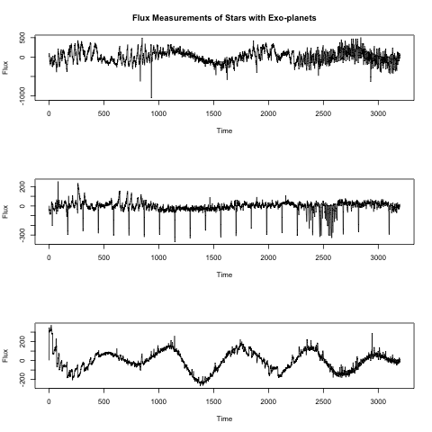
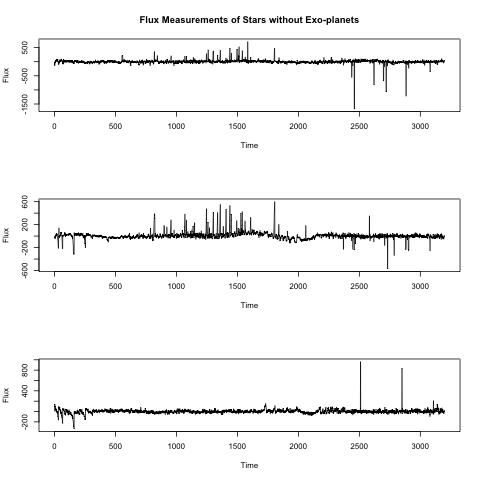
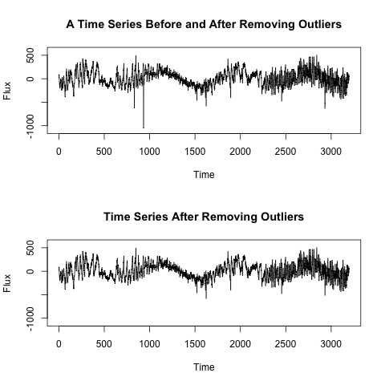
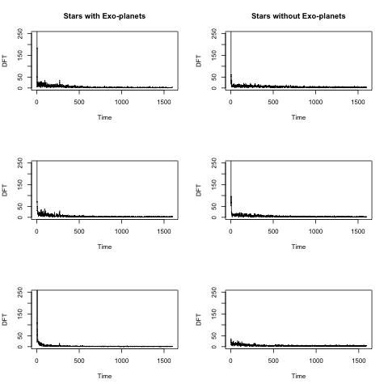
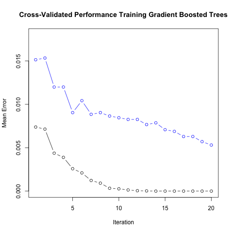

```{r setup, include=FALSE}
if (!require(kableExtra)) install.packages("kableExtra")
if (!require(tidyverse)) install.packages("tidyverse")

library(kableExtra)
library(tidyverse)

knitr::opts_chunk$set(echo = FALSE, fig.align="center")
```
# Introduction
Is there life in the Universe outside our own solar system? One aspect of investigating this question is finding planets that orbit stars other than Earth's sun. Such planets are called exoplanets. Astronomers search for exoplanets by measuring the change in light intensity (flux) over time. A regular pattern of dimming may indicate the presence of an exoplanet. The goal is to identify candidate stars that likely have exoplanets. Once identified, a more resource-intensive investigation can confirm  or deny the presence of an exoplanet. 

The main problem in the search for exoplanets is that few stars will have an exoplanet. For instance, in data collected by the NASA Kepler space telescope, less than 1 percent of the stars were found to have an exoplanet. We are searching for an exoplanet in a haystack! Because thousands of 
stars need to be investigated, a reliable, efficient method is needed to identify candidate stars. A machine learning algorithm is ideally suited for this task.

We can train a binary classification algorithm on a dataset with flux measurements of previously identified positive examples (stars with exoplanets) and negative examples (stars without exoplanets). After training, we can use the algorithm to screen many new observations. The algorithm needs to have a low false negative rate, that is, if a star has an exoplanet, it will most likely be identified as a candidate. Without a low false negative rate, the algorithm will leave many exoplanets undiscovered. Also important is a low false positive rate, that is, only a few stars without an exoplanet are identified as candidates. Without a low false positive rate, resources are wasted investigating red herrings. Ideally, a classification algorithm has both a low false negative and a low false positive rate, but this often is a trade-off we need to consider.

Because there few positive examples (known exoplanets), training a classification algorithm requires special care. The optimal (hyper)parameters of a binary classification algorithm are usually determined based on maximizing accuracy. With few actual positive examples, the accuracy of an algorithm that never predicts a positive outcome (candidate star) is quite high. For example, suppose there is 1 candidate star out of a 100 stars (1 percent positive rate). The algorithm that always predicts "no exoplanet" has an accuracy of 99% but is practically useless. The algorithms used in this project address the imbalance in the training data (specifically, either by down-sampling or by computing a weighted error rate). 

# Overview

The purpose of this project was to train a classifier that can identify stars likely to have an exoplanet based on flux measurements over time.

## Datasets
The data used for this project were made available for the Kaggle competition
[Hunting Exoplanets in Deep Space](https://www.kaggle.com/keplersmachines/kepler-labelled-time-series-data). The training dataset consists of flux measurements for 5,087 stars. Each observation is a time series of 3,197 flux measurements. Only 0.73 percent of the stars have a confirm exoplanet (positive cases, 37 out of 5,087), with the remaining 99.27 percent having no exoplanet (negative cases, 5,050 out of 5,087). The test dataset consists of 570 observations, 0.88 percent with an exoplanet (5 positive cases out of 570) and 99.12 percent (565 negative cases out of 570).

## Key Steps
The following key steps were performed:

1. Preprocessing 
   1. Identify and correct any outliers in the time series data
   2. Normalize every time series to the range $[0, 1]$
   
2. Feature Extraction
   1. Transform each normalized time series to its corresponding Fourier series

2. Training
   1. Using only the training data, train two binary classification algorithms:
      - logistic regression
      - gradient boosted trees
   2. Address the training imbalance during fitting 
      - down-sampling for logistic regression
      - weighted error for gradient boosted trees)
   3. Tune the hyperparameters of these algorithms through cross-validation

3. Evaluation
   1. Using the test data, evaluate the final models on accuracy, precision, recall, and $F_1$ scores.

The remainder of this report consists of a methods section, a results section, and a conclusion. All code, data, and reports are available in the Github repository [vincentkieftenbeld/exoplanets](https://github.com/vincentkieftenbeld/exoplanets).

# Methods
This section describes the preprocessing and feature extraction steps, as well as the machine learning models and evaluation metrics used.

## Preprocessing
Each observation is a time series of flux measurements. The following figures show example time series for stars with and without exoplanets.
<center>
 
 </center>
 
 <center>
  
</center>
Notice that the time series contain several spikes that appear to be outliers. 
For example, the first time series has two conspicuous spikes just before time 
$t = 1000$. The [tsclean](https://www.rdocumentation.org/packages/forecast/versions/8.15/topics/tsclean) function from the [forecast package](https://cran.r-project.org/web/packages/forecast/forecast.pdf) was used to identify and replace outliers in each time series. Compare the first time series before and after
outlier identification and replacement:
<center>

</center>

Also notice the different ranges in flux measurement. For example, 
the first time series has a much wider range compared to the third. This is 
understandable as stars naturally vary in brightness. Most machine learning 
algorithms work better when observations have comparable scales. Therefore, after 
outlier replacement each time series was normalized to have values between 0 and 1.

## Feature Extraction
Although we could use the flux measurements directly as 
features, it is better to extract a more informative representation. One such representation often used in signal processing is the [discrete Fourier transform](https://en.wikipedia.org/wiki/Discrete_Fourier_transform). R has a built-in function to compute the discrete Fourier transform (DFT) of an array with a fast algorithm, the [fast Fourier transform](https://en.wikipedia.org/wiki/Fast_Fourier_transform) (FFT). Because Fourier coeffients are complex numbers, we need to take their absolute value to convert the coeffients to real numbers. The absolute value of a complex number $z = a + bi$ equals its norm, 
$$
\lVert a + bi \rVert = \sqrt{a^2 + b^2}
$$
The Fourier series is [mirrored](https://dsp.stackexchange.com/questions/4825/why-is-the-fft-mirrored). Hence, only the first half of the coefficients is needed as input for the machine learning algorithms. This reduces the dimension of the feature vectors from 3,197 to 1,599 values, speeding up the training a bit.

The following figure shows the final time series for the six examples shown earlier. The range is restricted, as the first few values of a Fourier series are much larger than the rest. Although it may be difficult for a human to detect patterns in these Fourier series, it will turn out that machine learning algorithms are very good at it!

<center>

</center>


## Models
This is a supervised binary classification problem.
I trained two different models for this task: regularized logistic regression and gradient boosted trees.

Logistic regression can be considered a baseline model for binary classification problems. Logistic regression models the probability
$$
p(x) = P(Y = 1|X = x)
$$
 of a positive case $Y = 1$ given features $X = x$ using the log-odds equation:
 $$
 \log \frac{p(x)}{1 - p(x)} = \beta_0 + \beta_1 x_1 + \dots + \beta_p x_p.
 $$
The model parameters $\beta_0, \dots, \beta_p$ can be estimated by via penalized maximum likelihood. The penalization prevents overfitting through regularization. Hyperparameters $\alpha$ and $\lambda$ control the type and amount of regularization: The 
the elastic net mixing parameter $\alpha$ controls the type (with $\alpha$ = 0 being ridge regression and $\alpha = 1$ being lasso regression) and shrinkage parameter $\lambda$ determines (the amount of penalization). Both hyperparameters were tuned through 10-fold cross-validation repeated 5 times. Hyperparameter values were selected randomly. [Research](https://www.jmlr.org/papers/volume13/bergstra12a/bergstra12a) shows that a random search is more efficient than the traditional grid search. The [receiver operating characteristic](https://en.wikipedia.org/wiki/Receiver_operating_characteristic) curve was used to select the best values for $\alpha$ and $\lambda$.

The data imbalance was addressed by down-sampling the majority class, that is, randomly select as many negative examples as there are positive examples. A different subsample was picked for each cross-validation fold. The implementation of logistic regression in the [caret package](https://topepo.github.io/caret/) was used. This implementation is based on [glmnet](https://glmnet.stanford.edu/index.html). 

Gradient boosted trees is one of the most effective machine learning methods. It trains a sequence of decision trees, each subsequent tree tailored ("boosted") to the errors made by the previous trees.

Weights were used to address the class imbalances. Errors for minority examples (positive class) were given 137 times the weight of errors for the majority examples (negative class). Here, 137 is the ratio between the number of majority and minority cases. Various hyperparameters control this learning algorithm, including learning rate $\eta$, minimum split loss $\gamma$, and maximum tree depth. Based on 10-fold cross-validation, the default parameter values already produced excellent results with 100 rounds of boosting and no further tuning was needed. The [xgboost](https://xgboost.readthedocs.io/en/latest/) implementation of gradient boosting was used. 

## Evaluation
After training and hyperparameter tuning, the final models will be evaluated on the hold-out test set. The models will be evaluated on accuracy, precision, recall, and $F_1$ score. 

Although (unweighted) accuracy is not a good metric for parameter optimization, it is still the metric of substantive interest. The other three metrics are defined as follows:
$$
\text{precision} = \frac{\text{true positives}}{\text{true positives} + \text{false positives}},
$$
$$
\text{recall} = \frac{\text{true positives}}{\text{true positives} + \text{false negatives}},
$$
and
$$
F_1 = 2 \times \frac{\text{precision} \cdot \text{recall}}{\text{precision} + \text{recall}}.
$$

# Results
After preprocessing and feature extraction, both machine learning algorithms were fitted to the training data using 10-fold cross-validation.

For logistic regression, 50 randomly select parameter combinations were tried. The following table shows the three best hyperparameter combinations 
```{r echo=FALSE}
df <- data.frame(
  alpha = c(0.3227051, 0.5747184, 0.7805507),
  lambda = c(0.120707063, 0.008481739, 0.013207760),
  ROC = c(0.9521353, 0.9500627, 0.9451650)
)
df <- t(df)

df %>%
  kbl(caption = "Cross-validition for Logistic Regression") %>%
  kable_styling(latex_options = "HOLD_position")
```
The final values used for the logistic regression model were $\alpha \approx 0.323$ and $\lambda \approx 0.121$.
 
 The gradient boosting algorithm iteratively fits decision trees, reducing the training error as well as the (cross) validation error with each iteration. The following figure shows the mean weighted error on the training set (black line) and on the validation set (blue line).
 <center>
 
 </center>
 The mean weighted error on the training set rapidly decreased and stabilized after 12 iterations. The mean weighted error on the validation set after 20 iterations is $< 0.01$. Because this error rate was so small, no further hyperparameter tuning was necessary.
 
After training, both models were evaluated on the hold-out test data. The performance of each algorithm can easily be understood by considering their [confusion matrix](https://en.wikipedia.org/wiki/Confusion_matrix).
The rows in the confusion matrix represent predicted values (0 = no exoplanet, 1 = exoplanet) and the columns the actual values.
```{r echo=FALSE}
cm.lr <- data.frame(
  pred = c(489, 76),
  actual = c(0, 5)
)
rownames(cm.lr) <- c(0, 1)
cm.lr %>%
  kbl(caption = "Confusion Matrix for Logistic Regression", col.names = c(0, 1)) %>%   kable_styling(latex_options = "HOLD_position")
```
Logistic regression correctly identifies the 5 positive examples in the test set. It also correctly predicts no exoplanet for 489 negative test cases out of 565. However, 76 stars are incorrectly identified as candidates for exoplanets (false positives). 

As can been seen in the following confusion matrix, the gradient boosted tree model achieves perfect accuracy.
```{r echo=FALSE}
cm.gbt <- data.frame(
  pred = c(565, 0),
  actual = c(0, 5)
)
rownames(cm.gbt) <- c(0, 1)
cm.gbt %>%
  kbl(caption = "Confusion Matrix for Gradient Boosted Tree Model", col.names = c(0, 1)) %>%   kable_styling(latex_options = "HOLD_position")
```
The following table summarizes and compares model performance by considering accuracy, precision, recall, and $F_1$ score (lr = logistic regression, gbt = gradient boosted trees).
```{r echo=FALSE}
dt <- data.frame(
  accuracy = c(0.93, 1.00),
  precision = c(1.00, 1.00),
  recall = c(0.92, 1.00),
  F1 = c(0.96, 1.00)
)
dt <- t(dt)
colnames(dt) <- c("lr", "gbt")

dt %>%
  kbl(caption = "Performance on test set") %>%
  kable_styling(latex_options = "HOLD_position")
```

# Conclusion
In this project, I trained a binary classifier to identify stars that are likely to have an exoplanet. There are two interesting aspects to this machine learning problem:

1. The inputs are a time series, instead of the more common set of unrelated variables. The time series contained outliers and differed in range.
2. The data are imbalanced, with many more negative than positive examples.

The first challenge was met by identifying and correcting outliers, normalizing the time series values, and converting each time series to its Fourier series (absolute values).

The second challenge was addressed either by down-sampling (sampling fewer negative examples) at each cross-validation iteration or by weighting errors more heavily for positive examples (using the ratio of negative to positive examples as weight).

I trained two classification models: regularized logistic regression and gradient boosted trees. Logistic regression with down-sampling achieved acceptable performance, with only 76 false positives out of 565 cases and no false negatives. This performance is particularly impressive, because down-sampling means that the algorithm does not use most of the negative examples for learning. It is possible that more advanced techniques to address class imbalances would reduce the false positive rate of logistic regression. For example, the [synthetic minority oversampling technique](https://arxiv.org/pdf/1106.1813.pdf) (SMOTE) adds new, artifical positive examples to the training data.

Instead of reducing the number of majority cases (down-sampling) or increasing the number of minority cases (e.g., SMOTE), class imbalances can also be addressed by weighing errors more heavily for the positive cases. The performance of the gradient boosted tree algorithms with weights shows that this can lead to excellent results. The algorithm achieved perfect accuracy on the test set, correctly identifying 5 positive cases out of 570 with no false positives. This result demonstrates that the xgboost algorithm
is still an [effective tool](
https://www.kdnuggets.com/2017/10/xgboost-top-machine-learning-method-kaggle-explained.html) for machine learning.


